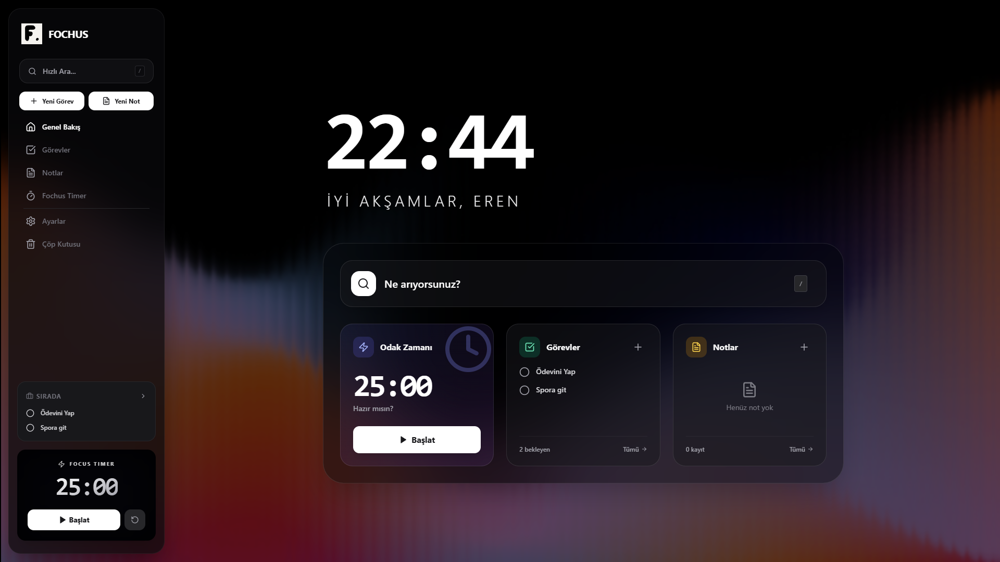
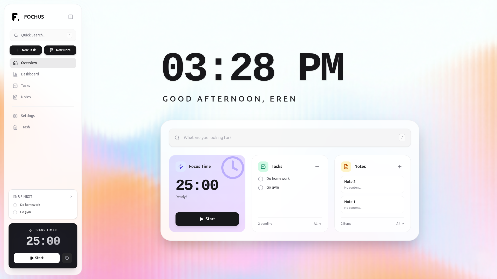
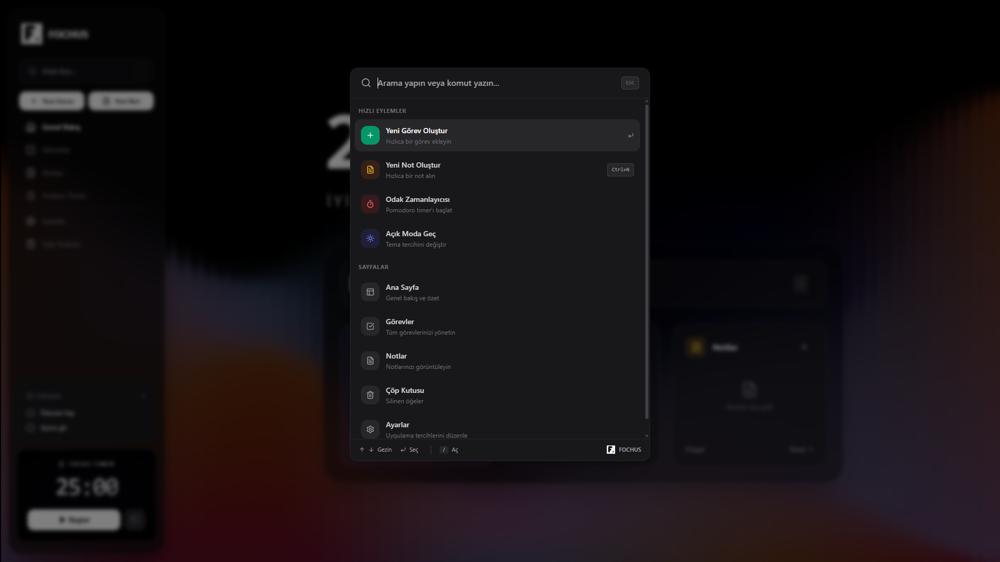

<div align="center">
  
  <h1>Fochus</h1>
  <p>Manage Your Productivity and Focus Time</p>
</div>

<div align="center">


</div>

<p align="center">
  <strong>Fochus</strong> is a modern, all-in-one personal productivity suite designed to help you stay organized and focused. It combines task management, note-taking, and a Pomodoro timer into a single, sleek, and intuitive interface.
</p>

<p align="center">
  <strong>Developer:</strong> Eren Çakar
</p>

<div align="center">

[Features](#features) •
[Technologies](#technologies) •
[Installation](#installation) •
[License](#license)

</div>

---

## App Preview

Fochus comes with an eye-friendly dark mode and a spacious light mode. You can use the system theme or select manually according to your preference.

### Light and Dark Mode

<div align="center">
  
  <br>
  <em>Stylish and focus-enhancing Dark Mode</em>
  <br><br>
  
  <br>
  <em>Clean and spacious Light Mode</em>
</div>

---

## Spotlight: Everything at Your Fingertips

Don't get lost in the app! Access your notes, tasks, and settings in seconds with the **Spotlight** feature (`/` key).

<div align="center">
  
</div>

---

## Features

Fochus is developed with user experience and efficiency in mind.

### Smart Notes
*   **Rich Text Editor:** Format and detail your notes.
*   **Pinning & Organization:** Keep important notes at the top.
*   **Trash System:** Safely restore deleted notes or delete them permanently.
*   **Task Integration:** Link your notes directly with your tasks.

### Advanced Task Management
*   **Custom Lists:** Separate tasks into project-based lists and use color codes.
*   **Recurring Tasks:** Create daily, weekly, or monthly routines.
*   **Drag & Drop:** Easily sort tasks with `@hello-pangea/dnd`.
*   **Subtasks:** Break down complex jobs into manageable small parts.
*   **Smart Statuses:** Track Pending, Completed, or Deferred jobs.

### Integrated Pomodoro Timer
*   **Focus Modes:** Built-in timer for Work, Short Break, and Long Break.
*   **Session Tracking:** Automatically save sessions to track your productivity history.
*   **Distraction-Free Interface:** Simplified view to help you stay in the flow.

---

## Technologies

Developed with the most modern web technologies for performance and scalability.

### Frontend
| Technology | Description |
| --- | --- |
|  | User interface library. |
|  | Next generation frontend tooling. |
|  | JavaScript superset providing type safety. |
|  | Utility-first CSS framework. |
| **Lucide React** | Consistent and beautiful icon set. |

### Backend
| Technology | Description |
| --- | --- |
|  | JS runtime built on Chrome's V8 engine. |
|  | Fast, minimalist web framework. |
|  | Next-generation Node.js and TypeScript ORM. |
|  | The world's most advanced open source relational database. |
| **Zod** | TypeScript-first schema validation library. |

### Infrastructure
*   **Docker & Docker Compose:** Containerization for easy setup and deployment.
*   **Nginx:** For serving static files and reverse proxy operations.

---

## Installation

You can use **Docker** (recommended) or manual installation methods to run the project.

### Prerequisites

*   [Node.js](https://nodejs.org/) (v18 or higher)
*   [Docker Desktop](https://www.docker.com/products/docker-desktop)
*   [Git](https://git-scm.com/)

### Option 1: Quick Setup with Docker (Recommended)

1.  **Clone the repository**
    ```bash
    git clone https://github.com/username/fochus.git
    cd fochus
    ```

2.  **Set Environment Variables**
    Copy example files:
    ```bash
    cp .env.example .env
    cp backend/.env.example backend/.env
    ```
    
    > ⚠️ **Important Security Warning:**
    > After creating the `.env` files, **make sure to change** the `JWT_SECRET` value to a hard-to-guess, random string of characters. Default values are for development environment only.

3.  **Start the App**
    ```bash
    docker-compose up -d --build
    ```
    The application will start running at `http://localhost:5173`.

### Option 2: Manual Installation

#### Backend Setup
1.  Go to the backend folder:
    ```bash
    cd backend
    ```
2.  Install dependencies:
    ```bash
    npm install
    ```
3.  Create the database and configure the `DATABASE_URL` in the `backend/.env` file.
4.  Run migrations:
    ```bash
    npx prisma migrate dev
    ```
5.  Start the server:
    ```bash
    npm run dev
    ```

#### Frontend Setup
1.  Open a new terminal and return to the main directory:
    ```bash
    cd ..
    ```
2.  Install dependencies:
    ```bash
    npm install
    ```
3.  Start the development server:
    ```bash
    npm run dev
    ```

---

## Project Structure

```bash
fochus/
├── backend/                # Express API & Database logic
│   ├── prisma/            # Database schema & migrations
│   ├── src/
│   │   ├── middleware/    # Authentication & Error handling
│   │   ├── routes/        # API Routes (Auth, Notes, Tasks etc.)
│   │   └── index.ts       # Server entry point
│   └── ...
├── src/                    # Frontend React App
│   ├── components/        # Reusable UI components
│   ├── hooks/             # Custom React hooks
│   ├── pages/             # App pages/routes
│   ├── services/          # API service layer
│   └── ...
├── docker-compose.yml      # Container orchestration
└── ...
```

---

## License

Distributed under the MIT License. See `LICENSE` file for more information.

---

<div align="center">
  <p>Developed by <strong>Eren Çakar</strong></p>
</div>