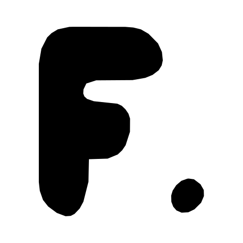
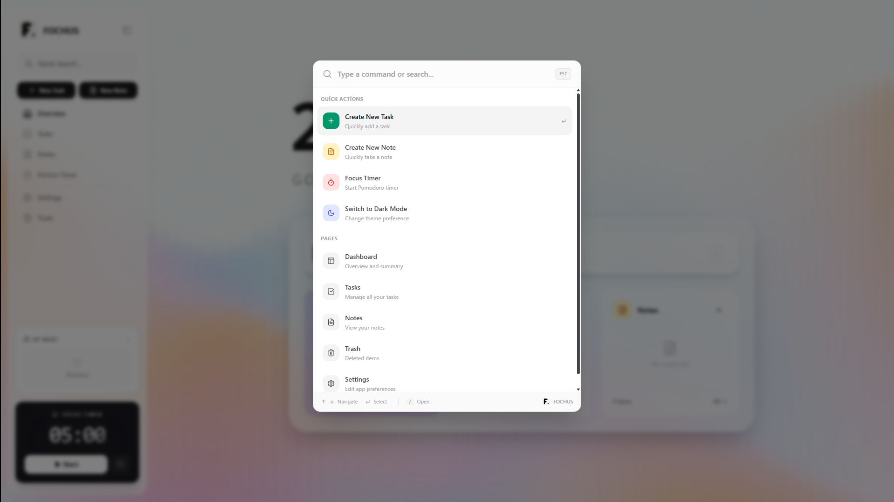

<div align="left">
  <table>
    <tr>
      <td width="80">
        
      </td>
      <td>
        <h1 style="margin: 0;">Fochus</h1>
        <p style="margin: 4px 0 0 0; color: #666;">Manage Your Productivity and Focus Time</p>
      </td>
    </tr>
  </table>
</div>

<br>

**Fochus** is a modern, all-in-one personal productivity suite designed to help you stay organized and focused. It combines task management, note-taking, and a Pomodoro timer into a single, sleek, and intuitive interface.

---

## Features

**Smart Notes** — Rich text editor with HTML formatting, pinning for quick access, trash system for safe deletion, and direct task linking.

**Task Management** — Custom lists with color coding, recurring tasks (daily, weekly, monthly), drag-and-drop sorting, subtasks, and status tracking (pending, completed, deferred).

**Pomodoro Timer** — Built-in work, short break, and long break modes with automatic session tracking and productivity history.

**Spotlight Search** — Press `/` to instantly search notes, tasks, and navigate the app without lifting your hands from the keyboard.

**Dark Mode** — System-aware theme with eye-friendly dark mode and a clean light mode. Toggle manually or follow system preferences.

**Docker Ready** — Single-command deployment with embedded SQLite. No external database required.

---

## App Preview

<div align="center">
  <table>
    <tr>
      <td width="50%" align="center">
        
        <br>
        <em>Clean and spacious Light Mode</em>
      </td>
      <td width="50%" align="center">
        
        <br>
        <em>Stylish and focus-enhancing Dark Mode</em>
      </td>
    </tr>
  </table>
</div>

---

## Spotlight

Access your notes, tasks, and settings in seconds without lifting your hands from the keyboard. Spotlight is a command palette that lets you search, create, and navigate the entire app with just the `/` key.

<div align="center">
  
</div>

---

## Quick Start

Download the portable package for your platform from the [latest release](https://github.com/sudoeren/fochus/releases/latest) and run:

### Linux / macOS

```bash
curl -L https://github.com/sudoeren/fochus/releases/latest/download/fochus-linux-x64.tar.gz | tar xz
cd fochus-linux-x64
./start.sh
```

### Windows

```powershell
# Download fochus-win-x64.zip from the latest release and extract
cd fochus-win-x64
.\start.bat
```

No Docker, Node.js, or any other dependency required. The package includes a portable Node.js runtime, the Prisma engine, and everything needed to run Fochus immediately.

> The app starts at **http://localhost:3001**. Data is stored in `data/fochus.db` next to the package.

---

## One-Line Install (Linux — Docker)

```bash
curl -sSL https://github.com/sudoeren/fochus/raw/main/install.sh | bash
```

Or from a local clone:

```bash
git clone https://github.com/sudoeren/fochus.git
cd fochus
bash install.sh
```

The script will build a single Docker image (backend + frontend + SQLite), start the container with auto-restart, and open port `3000`.

> **External access:** The app binds to `0.0.0.0:3000`. Access from anywhere on your network via `http://<server-ip>:3000`. For internet access, set up a reverse proxy (nginx, Caddy) or a tunnel (ngrok, Cloudflare Tunnel).

### Uninstall

```bash
bash <(curl -sSL https://github.com/sudoeren/fochus/raw/main/uninstall.sh)
```

### Other Setup Methods

#### Docker Compose

```bash
git clone https://github.com/sudoeren/fochus.git
cd fochus
cp .env.example .env
docker-compose up -d --build
```

Open **http://localhost:3000**.

#### Node.js (Direct, No Docker)

```bash
git clone https://github.com/sudoeren/fochus.git
cd fochus
npm run setup    # installs deps, creates SQLite DB, generates Prisma
npm start        # runs backend + frontend simultaneously
```

Open **http://localhost:5173**.

#### Development

```bash
# Terminal 1: Backend
cd backend
cp .env.example .env
npm install
npx prisma db push
npm run dev      # http://localhost:3001

# Terminal 2: Frontend
npm install
npm run dev      # http://localhost:5173
```

---

## Project Structure

```
fochus/
├── src/              React 19 SPA with Vite, Tailwind 4, TanStack Query
│   ├── components/   Reusable UI components
│   ├── pages/        View pages (Dashboard, Notes, Tasks, Settings, etc.)
│   ├── hooks/        Custom hooks (useTasks, useNotes, usePomodoro, etc.)
│   ├── services/     API client and external service integrations
│   ├── locales/      i18n translations (Turkish, English)
│   └── lib/          Utility functions
├── backend/          Express 5 REST API
│   ├── src/
│   │   ├── routes/   API route handlers
│   │   ├── middleware/  Auth, admin, error handler
│   │   └── lib/      Prisma client
│   └── prisma/       SQLite schema and migrations
├── public/           Static assets and service worker
├── docker-compose.yml  Full-stack deployment
├── Dockerfile        Single image (backend + frontend)
└── install.sh        One-line setup script
```

---

## FAQ

**Q: What are the main keyboard shortcuts?**  
A: Press `/` to open Spotlight for instant search and navigation.

**Q: Where is my data stored?**  
A: With the self-hosted Docker setup, data is stored in a SQLite database inside the `fochus_data` Docker volume. You can back up and restore via the Settings page.

**Q: Can I customize the Pomodoro timer?**  
A: Yes — customize work, short break, and long break durations, enable auto-start, and set the long break interval from the settings panel.

**Q: Is there a mobile version?**  
A: Fochus is intentionally desktop-first. A dedicated mobile experience is not planned for now.

**Q: How do I run tests?**  
A: Run `npm test` in the root for frontend tests or `cd backend && npm test` for backend tests. Both use Vitest.

---

## License

Distributed under the [MIT License](./LICENSE).

---

<div align="center">
  <sub>Built with React, Express, Prisma, SQLite — and a lot of focus.</sub>
</div>
